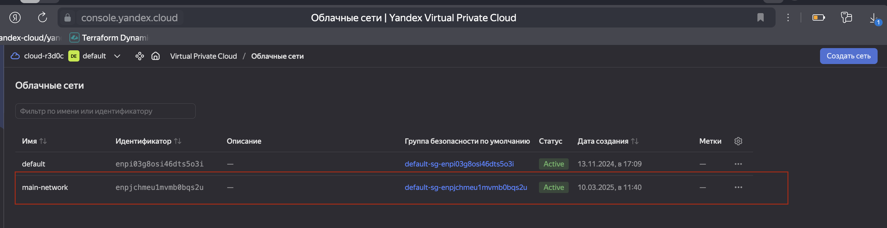
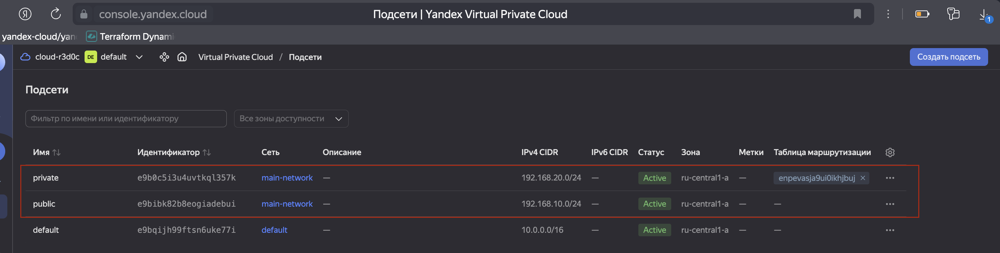
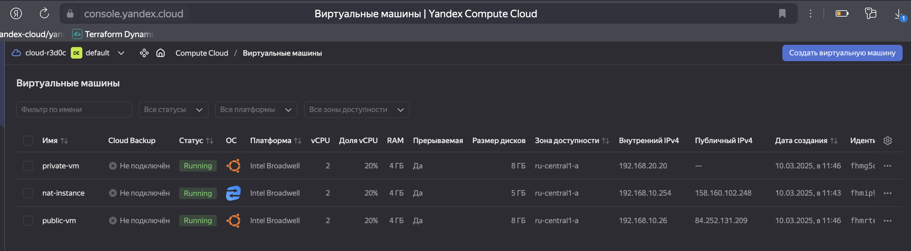
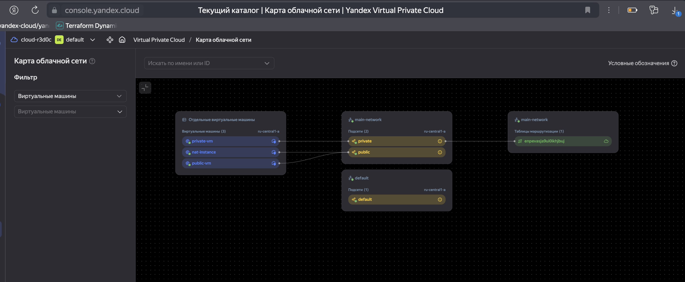

# Домашнее задание к занятию «Организация сети»

### Подготовка к выполнению задания

1. Домашнее задание состоит из обязательной части, которую нужно выполнить на провайдере Yandex Cloud, и дополнительной части в AWS (выполняется по желанию). 
2. Все домашние задания в блоке 15 связаны друг с другом и в конце представляют пример законченной инфраструктуры.  
3. Все задания нужно выполнить с помощью Terraform. Результатом выполненного домашнего задания будет код в репозитории. 
4. Перед началом работы настройте доступ к облачным ресурсам из Terraform, используя материалы прошлых лекций и домашнее задание по теме «Облачные провайдеры и синтаксис Terraform». Заранее выберите регион (в случае AWS) и зону.

---
### Задание 1. Yandex Cloud 

**Что нужно сделать**

1. Создать пустую VPC. Выбрать зону.
2. Публичная подсеть.

 - Создать в VPC subnet с названием public, сетью 192.168.10.0/24.
 - Создать в этой подсети NAT-инстанс, присвоив ему адрес 192.168.10.254. В качестве image_id использовать fd80mrhj8fl2oe87o4e1.
 - Создать в этой публичной подсети виртуалку с публичным IP, подключиться к ней и убедиться, что есть доступ к интернету.
3. Приватная подсеть.
 - Создать в VPC subnet с названием private, сетью 192.168.20.0/24.
 - Создать route table. Добавить статический маршрут, направляющий весь исходящий трафик private сети в NAT-инстанс.
 - Создать в этой приватной подсети виртуалку с внутренним IP, подключиться к ней через виртуалку, созданную ранее, и убедиться, что есть доступ к интернету.

Resource Terraform для Yandex Cloud:

- [VPC subnet](https://registry.terraform.io/providers/yandex-cloud/yandex/latest/docs/resources/vpc_subnet).
- [Route table](https://registry.terraform.io/providers/yandex-cloud/yandex/latest/docs/resources/vpc_route_table).
- [Compute Instance](https://registry.terraform.io/providers/yandex-cloud/yandex/latest/docs/resources/compute_instance).


#### Решение

[Проект](proj)

Применяем скрипты.

```bash
alekseykashin@Mac proj % terraform apply
var.yc_token
  Yandex Cloud OAuth token

  Enter a value: 

data.yandex_compute_image.ubuntu-2204-lts: Reading...
yandex_vpc_network.main: Refreshing state... [id=enpjchmeu1mvmb0bqs2u]
data.yandex_compute_image.ubuntu-2204-lts: Read complete after 1s [id=fd81r1dpns2m4mgssm0q]
yandex_vpc_route_table.private: Refreshing state... [id=enpevasja9ui0ikhjbuj]
yandex_vpc_subnet.public: Refreshing state... [id=e9bibk82b8eogiadebui]
yandex_vpc_subnet.private: Refreshing state... [id=e9b0c5i3u4uvtkql357k]
yandex_compute_instance.nat: Refreshing state... [id=fhmip92gnvnophqcvhhh]

Terraform used the selected providers to generate the following execution plan. Resource actions are
indicated with the following symbols:
  + create

Terraform will perform the following actions:

  # yandex_compute_instance.private will be created
  + resource "yandex_compute_instance" "private" {
      + created_at                = (known after apply)
      + folder_id                 = (known after apply)
      + fqdn                      = (known after apply)
      + gpu_cluster_id            = (known after apply)
      + hardware_generation       = (known after apply)
      + hostname                  = (known after apply)
      + id                        = (known after apply)
      + maintenance_grace_period  = (known after apply)
      + maintenance_policy        = (known after apply)
      + metadata                  = {
          + "ssh-keys" = <<-EOT
                alekseykashin@MacBook-Pro-Aleksej.local
            EOT
        }
      + name                      = "private-vm"
      + network_acceleration_type = "standard"
      + platform_id               = "standard-v1"
      + service_account_id        = (known after apply)
      + status                    = (known after apply)
      + zone                      = "ru-central1-a"

      + boot_disk {
          + auto_delete = true
          + device_name = (known after apply)
          + disk_id     = (known after apply)
          + mode        = (known after apply)

          + initialize_params {
              + block_size  = (known after apply)
              + description = (known after apply)
              + image_id    = "fd81r1dpns2m4mgssm0q"
              + name        = (known after apply)
              + size        = 8
              + snapshot_id = (known after apply)
              + type        = "network-hdd"
            }
        }

      + metadata_options (known after apply)

      + network_interface {
          + index              = (known after apply)
          + ip_address         = (known after apply)
          + ipv4               = true
          + ipv6               = (known after apply)
          + ipv6_address       = (known after apply)
          + mac_address        = (known after apply)
          + nat                = false
          + nat_ip_address     = (known after apply)
          + nat_ip_version     = (known after apply)
          + security_group_ids = (known after apply)
          + subnet_id          = "e9b0c5i3u4uvtkql357k"
        }

      + placement_policy (known after apply)

      + resources {
          + core_fraction = 20
          + cores         = 2
          + memory        = 4
        }

      + scheduling_policy {
          + preemptible = true
        }
    }

  # yandex_compute_instance.public will be created
  + resource "yandex_compute_instance" "public" {
      + created_at                = (known after apply)
      + folder_id                 = (known after apply)
      + fqdn                      = (known after apply)
      + gpu_cluster_id            = (known after apply)
      + hardware_generation       = (known after apply)
      + hostname                  = (known after apply)
      + id                        = (known after apply)
      + maintenance_grace_period  = (known after apply)
      + maintenance_policy        = (known after apply)
      + metadata                  = {
          + "ssh-keys" = <<-EOT
                alekseykashin@MacBook-Pro-Aleksej.local
            EOT
        }
      + name                      = "public-vm"
      + network_acceleration_type = "standard"
      + platform_id               = "standard-v1"
      + service_account_id        = (known after apply)
      + status                    = (known after apply)
      + zone                      = (sensitive value)

      + boot_disk {
          + auto_delete = true
          + device_name = (known after apply)
          + disk_id     = (known after apply)
          + mode        = (known after apply)

          + initialize_params {
              + block_size  = (known after apply)
              + description = (known after apply)
              + image_id    = "fd81r1dpns2m4mgssm0q"
              + name        = (known after apply)
              + size        = 8
              + snapshot_id = (known after apply)
              + type        = "network-hdd"
            }
        }

      + metadata_options (known after apply)

      + network_interface {
          + index              = (known after apply)
          + ip_address         = (known after apply)
          + ipv4               = true
          + ipv6               = (known after apply)
          + ipv6_address       = (known after apply)
          + mac_address        = (known after apply)
          + nat                = true
          + nat_ip_address     = (known after apply)
          + nat_ip_version     = (known after apply)
          + security_group_ids = (known after apply)
          + subnet_id          = "e9bibk82b8eogiadebui"
        }

      + placement_policy (known after apply)

      + resources {
          + core_fraction = 20
          + cores         = 2
          + memory        = 4
        }

      + scheduling_policy {
          + preemptible = true
        }
    }

Plan: 2 to add, 0 to change, 0 to destroy.

Changes to Outputs:
  + external_ip_address_private_vm = (known after apply)
  + external_ip_address_public_vm  = (known after apply)
  + internal_ip_address_private_vm = (known after apply)
  + internal_ip_address_public_vm  = (known after apply)

Do you want to perform these actions?
  Terraform will perform the actions described above.
  Only 'yes' will be accepted to approve.

  Enter a value: yes

yandex_compute_instance.public: Creating...
yandex_compute_instance.private: Creating...
yandex_compute_instance.public: Still creating... [10s elapsed]
yandex_compute_instance.private: Still creating... [10s elapsed]
yandex_compute_instance.public: Still creating... [20s elapsed]
yandex_compute_instance.private: Still creating... [20s elapsed]
yandex_compute_instance.private: Still creating... [30s elapsed]
yandex_compute_instance.public: Still creating... [30s elapsed]
yandex_compute_instance.public: Still creating... [40s elapsed]
yandex_compute_instance.private: Still creating... [40s elapsed]
yandex_compute_instance.public: Creation complete after 44s [id=fhmrtegjacketecnbfib]
yandex_compute_instance.private: Creation complete after 48s [id=fhmg5qu67tqfggrd43uj]

Apply complete! Resources: 2 added, 0 changed, 0 destroyed.

Outputs:

external_ip_address_nat_vm = "158.160.102.248"
external_ip_address_private_vm = ""
external_ip_address_public_vm = "84.252.131.209"
internal_ip_address_nat_vm = "192.168.10.254"
internal_ip_address_private_vm = "192.168.20.20"
internal_ip_address_public_vm = "192.168.10.26"
alekseykashin@Mac proj % 

```

Сети


Подсети


Таблицы маршрутизации


Виртуальные машины


Схема сети


Проверка интернета с `public` vm
```bash
alekseykashin@Mac proj % ssh ubuntu@84.252.131.209
Welcome to Ubuntu 22.04.5 LTS (GNU/Linux 5.15.0-133-generic x86_64)

 * Documentation:  https://help.ubuntu.com
 * Management:     https://landscape.canonical.com
 * Support:        https://ubuntu.com/pro

 System information as of Mon Mar 10 09:20:16 AM UTC 2025

  System load:  0.17              Processes:             165
  Usage of /:   52.7% of 7.79GB   Users logged in:       0
  Memory usage: 6%                IPv4 address for eth0: 192.168.10.26
  Swap usage:   0%


Expanded Security Maintenance for Applications is not enabled.

0 updates can be applied immediately.

Enable ESM Apps to receive additional future security updates.
See https://ubuntu.com/esm or run: sudo pro status


The list of available updates is more than a week old.
To check for new updates run: sudo apt update


The programs included with the Ubuntu system are free software;
the exact distribution terms for each program are described in the
individual files in /usr/share/doc/*/copyright.

Ubuntu comes with ABSOLUTELY NO WARRANTY, to the extent permitted by
applicable law.

To run a command as administrator (user "root"), use "sudo <command>".
See "man sudo_root" for details.

ubuntu@fhmrtegjacketecnbfib:~$ curl ya.ru
ubuntu@fhmrtegjacketecnbfib:~$ ping ya.ru
PING ya.ru (77.88.55.242) 56(84) bytes of data.
64 bytes from ya.ru (77.88.55.242): icmp_seq=1 ttl=249 time=4.05 ms
64 bytes from ya.ru (77.88.55.242): icmp_seq=2 ttl=249 time=3.46 ms
64 bytes from ya.ru (77.88.55.242): icmp_seq=3 ttl=249 time=3.46 ms
^C
--- ya.ru ping statistics ---
3 packets transmitted, 3 received, 0% packet loss, time 2003ms
rtt min/avg/max/mdev = 3.459/3.657/4.053/0.279 ms
```

Проверка интернета с `private` vm
```bash
alekseykashin@Mac proj % ssh -J ubuntu@84.252.131.209 ubuntu@192.168.20.20
The authenticity of host '192.168.20.20 (<no hostip for proxy command>)' can't be established.
ED25519 key fingerprint is SHA256:YeY8Db4yd3AX6mGsGE8ujYNXN0hm56JEPrhgUVEuXsw.
This key is not known by any other names.
Are you sure you want to continue connecting (yes/no/[fingerprint])? yes
Warning: Permanently added '192.168.20.20' (ED25519) to the list of known hosts.
Welcome to Ubuntu 22.04.5 LTS (GNU/Linux 5.15.0-133-generic x86_64)

 * Documentation:  https://help.ubuntu.com
 * Management:     https://landscape.canonical.com
 * Support:        https://ubuntu.com/pro

 System information as of Mon Mar 10 09:47:44 AM UTC 2025

  System load:  0.0               Processes:             129
  Usage of /:   52.6% of 7.79GB   Users logged in:       0
  Memory usage: 5%                IPv4 address for eth0: 192.168.20.20
  Swap usage:   0%


Expanded Security Maintenance for Applications is not enabled.

0 updates can be applied immediately.

Enable ESM Apps to receive additional future security updates.
See https://ubuntu.com/esm or run: sudo pro status


The list of available updates is more than a week old.
To check for new updates run: sudo apt update


The programs included with the Ubuntu system are free software;
the exact distribution terms for each program are described in the
individual files in /usr/share/doc/*/copyright.

Ubuntu comes with ABSOLUTELY NO WARRANTY, to the extent permitted by
applicable law.

To run a command as administrator (user "root"), use "sudo <command>".
See "man sudo_root" for details.

ubuntu@fhmg5qu67tqfggrd43uj:~$ curl ya.ru
ubuntu@fhmg5qu67tqfggrd43uj:~$ ping ya.ru
PING ya.ru (77.88.44.242) 56(84) bytes of data.
64 bytes from ya.ru (77.88.44.242): icmp_seq=1 ttl=52 time=7.03 ms
64 bytes from ya.ru (77.88.44.242): icmp_seq=2 ttl=52 time=5.75 ms
64 bytes from ya.ru (77.88.44.242): icmp_seq=3 ttl=52 time=5.63 ms
64 bytes from ya.ru (77.88.44.242): icmp_seq=4 ttl=52 time=5.61 ms
^C
--- ya.ru ping statistics ---
4 packets transmitted, 4 received, 0% packet loss, time 3005ms
rtt min/avg/max/mdev = 5.608/6.005/7.033/0.595 ms
ubuntu@fhmg5qu67tqfggrd43uj:~$ 
```

---
### Задание 2. AWS* (задание со звёздочкой)

Это необязательное задание. Его выполнение не влияет на получение зачёта по домашней работе.

**Что нужно сделать**

1. Создать пустую VPC с подсетью 10.10.0.0/16.
2. Публичная подсеть.

 - Создать в VPC subnet с названием public, сетью 10.10.1.0/24.
 - Разрешить в этой subnet присвоение public IP по-умолчанию.
 - Создать Internet gateway.
 - Добавить в таблицу маршрутизации маршрут, направляющий весь исходящий трафик в Internet gateway.
 - Создать security group с разрешающими правилами на SSH и ICMP. Привязать эту security group на все, создаваемые в этом ДЗ, виртуалки.
 - Создать в этой подсети виртуалку и убедиться, что инстанс имеет публичный IP. Подключиться к ней, убедиться, что есть доступ к интернету.
 - Добавить NAT gateway в public subnet.
3. Приватная подсеть.
 - Создать в VPC subnet с названием private, сетью 10.10.2.0/24.
 - Создать отдельную таблицу маршрутизации и привязать её к private подсети.
 - Добавить Route, направляющий весь исходящий трафик private сети в NAT.
 - Создать виртуалку в приватной сети.
 - Подключиться к ней по SSH по приватному IP через виртуалку, созданную ранее в публичной подсети, и убедиться, что с виртуалки есть выход в интернет.

Resource Terraform:

1. [VPC](https://registry.terraform.io/providers/hashicorp/aws/latest/docs/resources/vpc).
1. [Subnet](https://registry.terraform.io/providers/hashicorp/aws/latest/docs/resources/subnet).
1. [Internet Gateway](https://registry.terraform.io/providers/hashicorp/aws/latest/docs/resources/internet_gateway).

### Правила приёма работы

Домашняя работа оформляется в своём Git репозитории в файле README.md. Выполненное домашнее задание пришлите ссылкой на .md-файл в вашем репозитории.
Файл README.md должен содержать скриншоты вывода необходимых команд, а также скриншоты результатов.
Репозиторий должен содержать тексты манифестов или ссылки на них в файле README.md.
