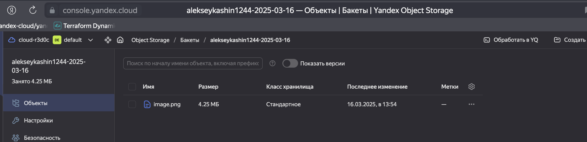

# Домашнее задание к занятию «Вычислительные мощности. Балансировщики нагрузки»  

### Подготовка к выполнению задания

1. Домашнее задание состоит из обязательной части, которую нужно выполнить на провайдере Yandex Cloud, и дополнительной части в AWS (выполняется по желанию). 
2. Все домашние задания в блоке 15 связаны друг с другом и в конце представляют пример законченной инфраструктуры.  
3. Все задания нужно выполнить с помощью Terraform. Результатом выполненного домашнего задания будет код в репозитории. 
4. Перед началом работы настройте доступ к облачным ресурсам из Terraform, используя материалы прошлых лекций и домашних заданий.

---
## Задание 1. Yandex Cloud 

**Что нужно сделать**

1. Создать бакет Object Storage и разместить в нём файл с картинкой:

 - Создать бакет в Object Storage с произвольным именем (например, _имя_студента_дата_).
 - Положить в бакет файл с картинкой.
 - Сделать файл доступным из интернета.
 
2. Создать группу ВМ в public подсети фиксированного размера с шаблоном LAMP и веб-страницей, содержащей ссылку на картинку из бакета:

 - Создать Instance Group с тремя ВМ и шаблоном LAMP. Для LAMP рекомендуется использовать `image_id = fd827b91d99psvq5fjit`.
 - Для создания стартовой веб-страницы рекомендуется использовать раздел `user_data` в [meta_data](https://cloud.yandex.ru/docs/compute/concepts/vm-metadata).
 - Разместить в стартовой веб-странице шаблонной ВМ ссылку на картинку из бакета.
 - Настроить проверку состояния ВМ.
 
3. Подключить группу к сетевому балансировщику:

 - Создать сетевой балансировщик.
 - Проверить работоспособность, удалив одну или несколько ВМ.
4. (дополнительно)* Создать Application Load Balancer с использованием Instance group и проверкой состояния.

Полезные документы:

- [Compute instance group](https://registry.terraform.io/providers/yandex-cloud/yandex/latest/docs/resources/compute_instance_group).
- [Network Load Balancer](https://registry.terraform.io/providers/yandex-cloud/yandex/latest/docs/resources/lb_network_load_balancer).
- [Группа ВМ с сетевым балансировщиком](https://cloud.yandex.ru/docs/compute/operations/instance-groups/create-with-balancer).


#### Лог


```bash
alekseykashin@Mac terraform % terraform validate
Success! The configuration is valid.

alekseykashin@Mac terraform % terraform apply   

Terraform used the selected providers to generate the following execution plan. Resource actions are indicated with the following symbols:
  + create

Terraform will perform the following actions:

  # yandex_alb_backend_group.backend_group will be created
  + resource "yandex_alb_backend_group" "backend_group" {
      + created_at = (known after apply)
      + folder_id  = (known after apply)
      + id         = (known after apply)
      + name       = "backend-group"

      + http_backend {
          + name             = "http-backend"
          + port             = 80
          + target_group_ids = (known after apply)
          + weight           = 1

          + healthcheck {
              + interval = "2s"
              + timeout  = "10s"

              + http_healthcheck {
                  + path = "/"
                }
            }
        }
    }

  # yandex_alb_http_router.router will be created
  + resource "yandex_alb_http_router" "router" {
      + created_at = (known after apply)
      + folder_id  = (known after apply)
      + id         = (known after apply)
      + name       = "http-router"
    }

  # yandex_alb_load_balancer.alb will be created
  + resource "yandex_alb_load_balancer" "alb" {
      + created_at   = (known after apply)
      + folder_id    = (known after apply)
      + id           = (known after apply)
      + log_group_id = (known after apply)
      + name         = "application-lb"
      + network_id   = (known after apply)
      + status       = (known after apply)

      + allocation_policy {
          + location {
              # At least one attribute in this block is (or was) sensitive,
              # so its contents will not be displayed.
            }
        }

      + listener {
          + name = "http-listener"

          + endpoint {
              + ports = [
                  + 80,
                ]

              + address {
                  + external_ipv4_address {
                      + address = (known after apply)
                    }
                }
            }

          + http {
              + handler {
                  + allow_http10       = false
                  + http_router_id     = (known after apply)
                  + rewrite_request_id = false
                }
            }
        }
    }

  # yandex_alb_target_group.lamp_targets will be created
  + resource "yandex_alb_target_group" "lamp_targets" {
      + created_at = (known after apply)
      + folder_id  = (known after apply)
      + id         = (known after apply)
      + name       = "lamp-targets"

      + target (known after apply)
    }

  # yandex_alb_virtual_host.virtual_host will be created
  + resource "yandex_alb_virtual_host" "virtual_host" {
      + http_router_id = (known after apply)
      + id             = (known after apply)
      + name           = "virtual-host"

      + route {
          + name = "route"

          + http_route {
              + http_route_action {
                  + backend_group_id = (known after apply)
                }
            }
        }
    }

  # yandex_compute_instance_group.lamp_group will be created
  + resource "yandex_compute_instance_group" "lamp_group" {
      + created_at          = (known after apply)
      + deletion_protection = false
      + folder_id           = (known after apply)
      + id                  = (known after apply)
      + instances           = (known after apply)
      + name                = "lamp-instance-group"
      + service_account_id  = (sensitive value)
      + status              = (known after apply)

      + allocation_policy {
          + zones = (sensitive value)
        }

      + deploy_policy {
          + max_creating     = 0
          + max_deleting     = 0
          + max_expansion    = 0
          + max_unavailable  = 1
          + startup_duration = 0
          + strategy         = (known after apply)
        }

      + health_check {
          + healthy_threshold   = 2
          + unhealthy_threshold = 2

          + http_options {
              + path = "/"
              + port = 80
            }
        }

      + instance_template {
          + labels      = {
              + "instance_group" = "lamp-group"
            }
          + metadata    = (known after apply)
          + platform_id = "standard-v1"

          + boot_disk {
              + device_name = (known after apply)
              + mode        = "READ_WRITE"

              + initialize_params {
                  + image_id    = "fd827b91d99psvq5fjit"
                  + size        = (known after apply)
                  + snapshot_id = (known after apply)
                  + type        = "network-hdd"
                }
            }

          + metadata_options (known after apply)

          + network_interface {
              + ip_address         = (known after apply)
              + ipv4               = true
              + ipv6               = (known after apply)
              + ipv6_address       = (known after apply)
              + nat                = true
              + network_id         = (known after apply)
              + security_group_ids = (known after apply)
              + subnet_ids         = (known after apply)
            }

          + resources {
              + core_fraction = 20
              + cores         = 2
              + memory        = 1
            }

          + scheduling_policy {
              + preemptible = true
            }
        }

      + scale_policy {
          + fixed_scale {
              + size = 3
            }
        }
    }

  # yandex_lb_network_load_balancer.nlb will be created
  + resource "yandex_lb_network_load_balancer" "nlb" {
      + created_at          = (known after apply)
      + deletion_protection = (known after apply)
      + folder_id           = (known after apply)
      + id                  = (known after apply)
      + name                = "network-lb"
      + region_id           = (known after apply)
      + type                = "external"

      + attached_target_group {
          + target_group_id = (known after apply)

          + healthcheck {
              + healthy_threshold   = 2
              + interval            = 2
              + name                = "http-healthcheck"
              + timeout             = 1
              + unhealthy_threshold = 2

              + http_options {
                  + path = "/"
                  + port = 80
                }
            }
        }

      + listener {
          + name        = "http-listener"
          + port        = 80
          + protocol    = (known after apply)
          + target_port = (known after apply)

          + external_address_spec {
              + address    = (known after apply)
              + ip_version = "ipv4"
            }
        }
    }

  # yandex_lb_target_group.lamp_targets will be created
  + resource "yandex_lb_target_group" "lamp_targets" {
      + created_at = (known after apply)
      + folder_id  = (known after apply)
      + id         = (known after apply)
      + name       = "lamp-targets"
      + region_id  = (known after apply)

      + target (known after apply)
    }

  # yandex_storage_bucket.bucket will be created
  + resource "yandex_storage_bucket" "bucket" {
      + acl                   = "public-read"
      + bucket                = (known after apply)
      + bucket_domain_name    = (known after apply)
      + default_storage_class = (known after apply)
      + folder_id             = (known after apply)
      + force_destroy         = false
      + id                    = (known after apply)
      + website_domain        = (known after apply)
      + website_endpoint      = (known after apply)

      + anonymous_access_flags (known after apply)

      + versioning (known after apply)
    }

  # yandex_storage_object.image will be created
  + resource "yandex_storage_object" "image" {
      + acl          = "public-read"
      + bucket       = (known after apply)
      + content_type = (known after apply)
      + id           = (known after apply)
      + key          = "image.png"
      + source       = "resources/image.png"
    }

  # yandex_vpc_network.network will be created
  + resource "yandex_vpc_network" "network" {
      + created_at                = (known after apply)
      + default_security_group_id = (known after apply)
      + folder_id                 = (known after apply)
      + id                        = (known after apply)
      + labels                    = (known after apply)
      + name                      = "network"
      + subnet_ids                = (known after apply)
    }

  # yandex_vpc_security_group.lamp_sg will be created
  + resource "yandex_vpc_security_group" "lamp_sg" {
      + created_at = (known after apply)
      + folder_id  = (known after apply)
      + id         = (known after apply)
      + labels     = (known after apply)
      + name       = "lamp-security-group"
      + network_id = (known after apply)
      + status     = (known after apply)

      + egress {
          + description       = "Outgoing traffic"
          + from_port         = -1
          + id                = (known after apply)
          + labels            = (known after apply)
          + port              = -1
          + protocol          = "ANY"
          + to_port           = -1
          + v4_cidr_blocks    = [
              + "0.0.0.0/0",
            ]
          + v6_cidr_blocks    = []
            # (2 unchanged attributes hidden)
        }

      + ingress {
          + description       = "HTTP"
          + from_port         = -1
          + id                = (known after apply)
          + labels            = (known after apply)
          + port              = 80
          + protocol          = "TCP"
          + to_port           = -1
          + v4_cidr_blocks    = [
              + "0.0.0.0/0",
            ]
          + v6_cidr_blocks    = []
            # (2 unchanged attributes hidden)
        }
    }

  # yandex_vpc_subnet.public_subnet will be created
  + resource "yandex_vpc_subnet" "public_subnet" {
      + created_at     = (known after apply)
      + folder_id      = (known after apply)
      + id             = (known after apply)
      + labels         = (known after apply)
      + name           = "public-subnet"
      + network_id     = (known after apply)
      + v4_cidr_blocks = [
          + "192.168.10.0/24",
        ]
      + v6_cidr_blocks = (known after apply)
      + zone           = (sensitive value)
    }

Plan: 13 to add, 0 to change, 0 to destroy.

Changes to Outputs:
  + alb_external_ip = [
      + [
          + [
              + [
                  + (known after apply),
                ],
            ],
        ],
    ]
  + bucket_url      = (known after apply)
  + instance_ips    = (known after apply)
  + nlb_external_ip = [
      + [
          + (known after apply),
        ],
    ]

Do you want to perform these actions?
  Terraform will perform the actions described above.
  Only 'yes' will be accepted to approve.

  Enter a value: yes

yandex_alb_http_router.router: Creating...
yandex_vpc_network.network: Creating...
yandex_storage_bucket.bucket: Creating...
yandex_alb_http_router.router: Creation complete after 0s [id=ds7dtamm2pumi670m2ko]
yandex_storage_bucket.bucket: Creation complete after 2s [id=alekseykashin1244-2025-03-16]
yandex_storage_object.image: Creating...
yandex_vpc_network.network: Creation complete after 2s [id=enptest29ggboo9u9lro]
yandex_vpc_subnet.public_subnet: Creating...
yandex_vpc_security_group.lamp_sg: Creating...
yandex_vpc_subnet.public_subnet: Creation complete after 0s [id=e9bp15ms0keeou85s6h6]
yandex_alb_load_balancer.alb: Creating...
yandex_storage_object.image: Creation complete after 1s [id=image.png]
yandex_vpc_security_group.lamp_sg: Creation complete after 2s [id=enpbhvc7613nddr5ik67]
yandex_compute_instance_group.lamp_group: Creating...
yandex_alb_load_balancer.alb: Still creating... [10s elapsed]
yandex_compute_instance_group.lamp_group: Still creating... [10s elapsed]
yandex_alb_load_balancer.alb: Still creating... [20s elapsed]
yandex_compute_instance_group.lamp_group: Still creating... [20s elapsed]
yandex_alb_load_balancer.alb: Still creating... [30s elapsed]
yandex_compute_instance_group.lamp_group: Still creating... [30s elapsed]
yandex_alb_load_balancer.alb: Still creating... [40s elapsed]
yandex_compute_instance_group.lamp_group: Still creating... [40s elapsed]
yandex_alb_load_balancer.alb: Still creating... [50s elapsed]
yandex_compute_instance_group.lamp_group: Still creating... [50s elapsed]
yandex_alb_load_balancer.alb: Still creating... [1m0s elapsed]
yandex_compute_instance_group.lamp_group: Still creating... [1m0s elapsed]
yandex_alb_load_balancer.alb: Still creating... [1m10s elapsed]
yandex_compute_instance_group.lamp_group: Still creating... [1m10s elapsed]
yandex_alb_load_balancer.alb: Still creating... [1m20s elapsed]
yandex_compute_instance_group.lamp_group: Still creating... [1m20s elapsed]
yandex_alb_load_balancer.alb: Still creating... [1m30s elapsed]
yandex_compute_instance_group.lamp_group: Still creating... [1m30s elapsed]
yandex_alb_load_balancer.alb: Still creating... [1m40s elapsed]
yandex_compute_instance_group.lamp_group: Still creating... [1m40s elapsed]
yandex_alb_load_balancer.alb: Still creating... [1m50s elapsed]
yandex_compute_instance_group.lamp_group: Still creating... [1m50s elapsed]
yandex_alb_load_balancer.alb: Still creating... [2m0s elapsed]
yandex_compute_instance_group.lamp_group: Still creating... [2m0s elapsed]
yandex_alb_load_balancer.alb: Still creating... [2m10s elapsed]
yandex_compute_instance_group.lamp_group: Still creating... [2m10s elapsed]
yandex_alb_load_balancer.alb: Still creating... [2m20s elapsed]
yandex_compute_instance_group.lamp_group: Still creating... [2m20s elapsed]
yandex_alb_load_balancer.alb: Still creating... [2m30s elapsed]
yandex_compute_instance_group.lamp_group: Still creating... [2m30s elapsed]
yandex_alb_load_balancer.alb: Still creating... [2m40s elapsed]
yandex_compute_instance_group.lamp_group: Still creating... [2m40s elapsed]
yandex_alb_load_balancer.alb: Still creating... [2m50s elapsed]
yandex_compute_instance_group.lamp_group: Still creating... [2m50s elapsed]
yandex_alb_load_balancer.alb: Still creating... [3m0s elapsed]
yandex_compute_instance_group.lamp_group: Still creating... [3m0s elapsed]
yandex_alb_load_balancer.alb: Still creating... [3m10s elapsed]
yandex_compute_instance_group.lamp_group: Still creating... [3m10s elapsed]
yandex_alb_load_balancer.alb: Still creating... [3m20s elapsed]
yandex_compute_instance_group.lamp_group: Still creating... [3m20s elapsed]
yandex_alb_load_balancer.alb: Still creating... [3m30s elapsed]
yandex_compute_instance_group.lamp_group: Still creating... [3m30s elapsed]
yandex_alb_load_balancer.alb: Still creating... [3m40s elapsed]
yandex_compute_instance_group.lamp_group: Still creating... [3m40s elapsed]
yandex_alb_load_balancer.alb: Still creating... [3m50s elapsed]
yandex_compute_instance_group.lamp_group: Still creating... [3m50s elapsed]
yandex_alb_load_balancer.alb: Still creating... [4m0s elapsed]
yandex_compute_instance_group.lamp_group: Still creating... [4m0s elapsed]
yandex_alb_load_balancer.alb: Still creating... [4m10s elapsed]
yandex_compute_instance_group.lamp_group: Still creating... [4m10s elapsed]
yandex_compute_instance_group.lamp_group: Creation complete after 4m13s [id=cl16ju6mi04vjcu5k7kf]
yandex_alb_target_group.lamp_targets: Creating...
yandex_lb_target_group.lamp_targets: Creating...
yandex_alb_target_group.lamp_targets: Creation complete after 0s [id=ds7t8s43gtj13plc69m3]
yandex_alb_backend_group.backend_group: Creating...
yandex_alb_backend_group.backend_group: Creation complete after 0s [id=ds7snm3p2vp9qkhqgo2b]
yandex_alb_virtual_host.virtual_host: Creating...
yandex_lb_target_group.lamp_targets: Creation complete after 1s [id=enphjq5b3r4gs8mihsm5]
yandex_lb_network_load_balancer.nlb: Creating...
yandex_alb_virtual_host.virtual_host: Creation complete after 2s [id=ds7dtamm2pumi670m2ko/virtual-host]
yandex_lb_network_load_balancer.nlb: Creation complete after 2s [id=enp2n55foj00qh7rmr61]
yandex_alb_load_balancer.alb: Still creating... [4m20s elapsed]
yandex_alb_load_balancer.alb: Still creating... [4m30s elapsed]
yandex_alb_load_balancer.alb: Creation complete after 4m35s [id=ds7dvqk3jib2tesi07ud]

Apply complete! Resources: 13 added, 0 changed, 0 destroyed.

Outputs:

alb_external_ip = tolist([
  tolist([
    tolist([
      tolist([
        "158.160.134.127",
      ]),
    ]),
  ]),
])
bucket_url = "http://alekseykashin1244-2025-03-16.storage.yandexcloud.net/image.png"
instance_ips = [
  "192.168.10.16",
  "192.168.10.5",
  "192.168.10.21",
]
nlb_external_ip = tolist([
  tolist([
    "130.193.57.56",
  ]),
])
alekseykashin@Mac terraform % 
```

#### Описание решения:

Создание бакета Object Storage:

1. Используется ресурс yandex_storage_bucket для создания бакета с уникальным именем, включающим имя студента и дату.
2. Файл изображения загружается с помощью yandex_storage_object с публичным доступом (acl = "public-read").

Создание Instance Group с LAMP:

1. Группа ВМ создается с использованием образа LAMP (image_id = "fd827b91d99psvq5fjit").
2. В разделе user_data выполняется установка Apache, MySQL, PHP и создание веб-страницы с ссылкой на изображение из бакета.
3. Настроена проверка состояния ВМ через HTTP на порт 80.

Настройка сетевого балансировщика:

1. Создается Network Load Balancer, который слушает порт 80.
2. Целевая группа lamp_targets динамически заполняется IP-адресами ВМ из Instance Group с использованием data.yandex_compute_instances.

Настройка баласнировщика приложений:

1. Создаем Target Group, которая будет включать ВМ из Instance Group.
2. Создаем Application Load Balancer, который будет распределять трафик между ВМ в Target Group.
3. Настраимваем проверку состояния (health check), чтобы ALB мог проверять доступность ВМ.

Дополнительные настройки:

1. Security Group разрешает входящий HTTP-трафик.
2. Публичная подсеть с NAT обеспечивает доступ ВМ в интернет.

Проверка работоспособности:

Бакет

```bash
alekseykashin@Mac terraform % yc storage bucket list
+------------------------------+----------------------+----------+-----------------------+---------------------+
|             NAME             |      FOLDER ID       | MAX SIZE | DEFAULT STORAGE CLASS |     CREATED AT      |
+------------------------------+----------------------+----------+-----------------------+---------------------+
| alekseykashin1244-2025-03-16 | b1gvqnla1h39vg6o82d0 |        0 | STANDARD              | 2025-03-16 10:54:28 |
+------------------------------+----------------------+----------+-----------------------+---------------------+
```

Файл в бакете


Виртуальные машины

```bash
alekseykashin@Mac terraform % yc compute instance list
+----------------------+---------------------------+---------------+---------+----------------+---------------+
|          ID          |           NAME            |    ZONE ID    | STATUS  |  EXTERNAL IP   |  INTERNAL IP  |
+----------------------+---------------------------+---------------+---------+----------------+---------------+
| fhmg6bel2qvd5mpt81v3 | cl16ju6mi04vjcu5k7kf-icix | ru-central1-a | RUNNING | 158.160.99.189 | 192.168.10.5  |
| fhmi0eck74qedbau1kid | cl16ju6mi04vjcu5k7kf-ydeq | ru-central1-a | RUNNING | 158.160.112.38 | 192.168.10.21 |
| fhmncqd614g9btdblcpj | cl16ju6mi04vjcu5k7kf-yjun | ru-central1-a | RUNNING | 158.160.40.65  | 192.168.10.16 |
+----------------------+---------------------------+---------------+---------+----------------+---------------+

```

Network Load Balancer (NLB)

```bash
alekseykashin@Mac terraform % yc load-balancer network-load-balancer list
+----------------------+------------+-------------+----------+----------------+------------------------+--------+
|          ID          |    NAME    |  REGION ID  |   TYPE   | LISTENER COUNT | ATTACHED TARGET GROUPS | STATUS |
+----------------------+------------+-------------+----------+----------------+------------------------+--------+
| enp2n55foj00qh7rmr61 | network-lb | ru-central1 | EXTERNAL |              1 | enphjq5b3r4gs8mihsm5   | ACTIVE |
+----------------------+------------+-------------+----------+----------------+------------------------+--------+

alekseykashin@Mac terraform % yc load-balancer network-load-balancer target-states --id enp2n55foj00qh7rmr61 --target-group-id enphjq5b3r4gs8mihsm5
+----------------------+---------------+---------+
|      SUBNET ID       |    ADDRESS    | STATUS  |
+----------------------+---------------+---------+
| e9bp15ms0keeou85s6h6 | 192.168.10.16 | HEALTHY |
| e9bp15ms0keeou85s6h6 | 192.168.10.21 | HEALTHY |
| e9bp15ms0keeou85s6h6 | 192.168.10.5  | HEALTHY |
+----------------------+---------------+---------+
```

Проверка запроса через Network Load Balancer (NLB)


Application Load Balancer (ALB)

```bash
alekseykashin@Mac terraform % yc alb target-group list
+----------------------+--------------+--------------+
|          ID          |     NAME     | TARGET COUNT |
+----------------------+--------------+--------------+
| ds7t8s43gtj13plc69m3 | lamp-targets |            3 |
+----------------------+--------------+--------------+

alekseykashin@Mac terraform % yc alb backend-group list
+----------------------+---------------+---------------------+--------------+---------------+----------+
|          ID          |     NAME      |       CREATED       | BACKEND TYPE | BACKEND COUNT | AFFINITY |
+----------------------+---------------+---------------------+--------------+---------------+----------+
| ds7snm3p2vp9qkhqgo2b | backend-group | 2025-03-16 10:58:46 | HTTP         |             1 | NONE     |
+----------------------+---------------+---------------------+--------------+---------------+----------+

alekseykashin@Mac terraform % yc alb http-router list  
+----------------------+-------------+-------------+-------------+
|          ID          |    NAME     | VHOST COUNT | ROUTE COUNT |
+----------------------+-------------+-------------+-------------+
| ds7dtamm2pumi670m2ko | http-router |           1 |           1 |
+----------------------+-------------+-------------+-------------+

alekseykashin@Mac terraform % yc alb load-balancer list
+----------------------+----------------+-----------+----------------+--------+
|          ID          |      NAME      | REGION ID | LISTENER COUNT | STATUS |
+----------------------+----------------+-----------+----------------+--------+
| ds7dvqk3jib2tesi07ud | application-lb |           |              1 | ACTIVE |
+----------------------+----------------+-----------+----------------+--------+

alekseykashin@Mac terraform % 
```

Проверка запроса через Application Load Balancer (ALB)


Проверка работоспособности при удалении одной машины

```bash
alekseykashin@Mac terraform % yc compute instance stop --id fhmg6bel2qvd5mpt81v3
done (20s)
alekseykashin@Mac terraform % yc compute instance stop --id fhmi0eck74qedbau1kid
done (17s)
alekseykashin@Mac terraform % yc compute instance list                          
+----------------------+---------------------------+---------------+--------------+----------------+---------------+
|          ID          |           NAME            |    ZONE ID    |    STATUS    |  EXTERNAL IP   |  INTERNAL IP  |
+----------------------+---------------------------+---------------+--------------+----------------+---------------+
| fhmg6bel2qvd5mpt81v3 | cl16ju6mi04vjcu5k7kf-icix | ru-central1-a | RUNNING      | 62.84.125.80   | 192.168.10.5  |
| fhmi0eck74qedbau1kid | cl16ju6mi04vjcu5k7kf-ydeq | ru-central1-a | PROVISIONING | 158.160.58.124 | 192.168.10.21 |
| fhmncqd614g9btdblcpj | cl16ju6mi04vjcu5k7kf-yjun | ru-central1-a | RUNNING      | 158.160.40.65  | 192.168.10.16 |
+----------------------+---------------------------+---------------+--------------+----------------+---------------+

alekseykashin@Mac terraform % yc compute instance list
+----------------------+---------------------------+---------------+---------+----------------+---------------+
|          ID          |           NAME            |    ZONE ID    | STATUS  |  EXTERNAL IP   |  INTERNAL IP  |
+----------------------+---------------------------+---------------+---------+----------------+---------------+
| fhmg6bel2qvd5mpt81v3 | cl16ju6mi04vjcu5k7kf-icix | ru-central1-a | RUNNING | 62.84.125.80   | 192.168.10.5  |
| fhmi0eck74qedbau1kid | cl16ju6mi04vjcu5k7kf-ydeq | ru-central1-a | RUNNING | 158.160.58.124 | 192.168.10.21 |
| fhmncqd614g9btdblcpj | cl16ju6mi04vjcu5k7kf-yjun | ru-central1-a | RUNNING | 158.160.40.65  | 192.168.10.16 |
+----------------------+---------------------------+---------------+---------+----------------+---------------+
```

---
## Задание 2*. AWS (задание со звёздочкой)

Это необязательное задание. Его выполнение не влияет на получение зачёта по домашней работе.

**Что нужно сделать**

Используя конфигурации, выполненные в домашнем задании из предыдущего занятия, добавить к Production like сети Autoscaling group из трёх EC2-инстансов с  автоматической установкой веб-сервера в private домен.

1. Создать бакет S3 и разместить в нём файл с картинкой:

 - Создать бакет в S3 с произвольным именем (например, _имя_студента_дата_).
 - Положить в бакет файл с картинкой.
 - Сделать доступным из интернета.
2. Сделать Launch configurations с использованием bootstrap-скрипта с созданием веб-страницы, на которой будет ссылка на картинку в S3. 
3. Загрузить три ЕС2-инстанса и настроить LB с помощью Autoscaling Group.

Resource Terraform:

- [S3 bucket](https://registry.terraform.io/providers/hashicorp/aws/latest/docs/resources/s3_bucket)
- [Launch Template](https://registry.terraform.io/providers/hashicorp/aws/latest/docs/resources/launch_template).
- [Autoscaling group](https://registry.terraform.io/providers/hashicorp/aws/latest/docs/resources/autoscaling_group).
- [Launch configuration](https://registry.terraform.io/providers/hashicorp/aws/latest/docs/resources/launch_configuration).

Пример bootstrap-скрипта:

```
#!/bin/bash
yum install httpd -y
service httpd start
chkconfig httpd on
cd /var/www/html
echo "<html><h1>My cool web-server</h1></html>" > index.html
```
### Правила приёма работы

Домашняя работа оформляется в своём Git репозитории в файле README.md. Выполненное домашнее задание пришлите ссылкой на .md-файл в вашем репозитории.
Файл README.md должен содержать скриншоты вывода необходимых команд, а также скриншоты результатов.
Репозиторий должен содержать тексты манифестов или ссылки на них в файле README.md.
