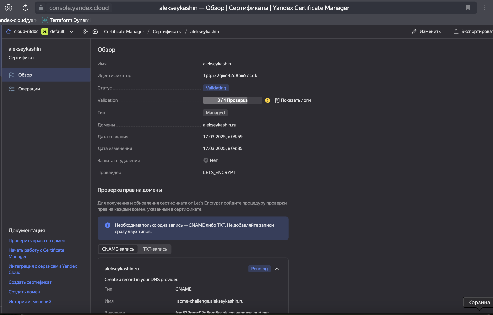
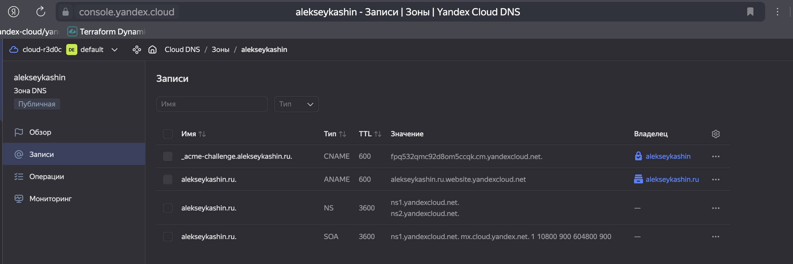
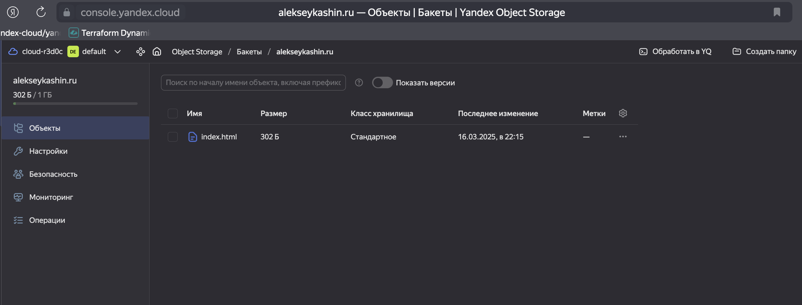
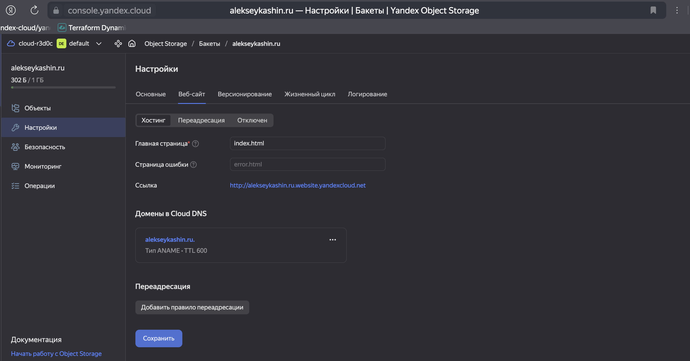
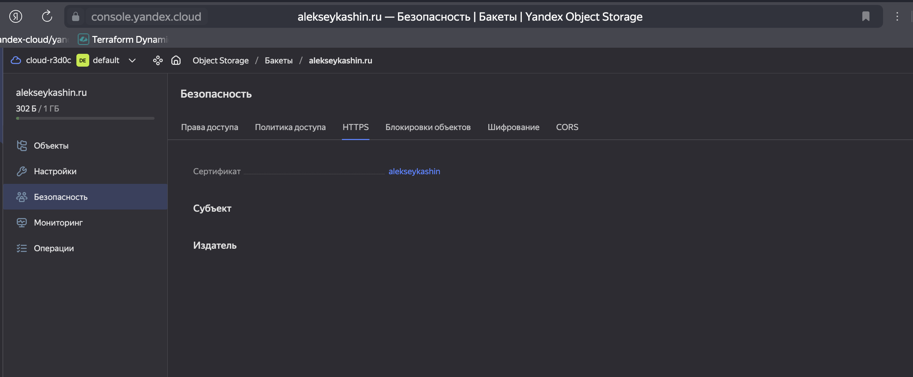

# Домашнее задание к занятию «Безопасность в облачных провайдерах»  

Используя конфигурации, выполненные в рамках предыдущих домашних заданий, нужно добавить возможность шифрования бакета.

---
## Задание 1. Yandex Cloud   

1. С помощью ключа в KMS необходимо зашифровать содержимое бакета:

 - создать ключ в KMS;
 - с помощью ключа зашифровать содержимое бакета, созданного ранее.
2. (Выполняется не в Terraform)* Создать статический сайт в Object Storage c собственным публичным адресом и сделать доступным по HTTPS:

 - создать сертификат;
 - создать статическую страницу в Object Storage и применить сертификат HTTPS;
 - в качестве результата предоставить скриншот на страницу с сертификатом в заголовке (замочек).

Полезные документы:

- [Настройка HTTPS статичного сайта](https://cloud.yandex.ru/docs/storage/operations/hosting/certificate).
- [Object Storage bucket](https://registry.terraform.io/providers/yandex-cloud/yandex/latest/docs/resources/storage_bucket).
- [KMS key](https://registry.terraform.io/providers/yandex-cloud/yandex/latest/docs/resources/kms_symmetric_key).

#### Решение

1. С помощью ключа в KMS зашифровываем содержимое бакета

- Создаем ключ KMS [kms.tf](terraform/kms.tf)

```bash
alekseykashin@Mac terraform % yc kms symmetric-key list
+----------------------+-----------------------+----------------------+-------------------+---------------------+--------+
|          ID          |         NAME          |  PRIMARY VERSION ID  | DEFAULT ALGORITHM |     CREATED AT      | STATUS |
+----------------------+-----------------------+----------------------+-------------------+---------------------+--------+
| abjmp4sov7piv9mk236j | bucket-encryption-key | abjenhqss4sq0u4435rv | AES_256           | 2025-03-16 17:57:54 | ACTIVE |
+----------------------+-----------------------+----------------------+-------------------+---------------------+--------+
```

```bash
alekseykashin@Mac terraform % yc kms symmetric-key get --id abjmp4sov7piv9mk236j
id: abjmp4sov7piv9mk236j
folder_id: b1gvqnla1h39vg6o82d0
created_at: "2025-03-16T17:57:54Z"
name: bucket-encryption-key
description: Key for encrypting bucket content
status: ACTIVE
primary_version:
  id: abjenhqss4sq0u4435rv
  key_id: abjmp4sov7piv9mk236j
  status: ACTIVE
  algorithm: AES_256
  created_at: "2025-03-16T17:57:54Z"
  primary: true
default_algorithm: AES_256
rotation_period: 31536000s
```

- Создаем бакет, добавляем в бакет шифрование ключом `object-storage.tf` [text](terraform/object-storage.tf)

```bash
alekseykashin@Mac terraform % yc storage bucket list
+------------------------------+----------------------+----------+-----------------------+---------------------+
|             NAME             |      FOLDER ID       | MAX SIZE | DEFAULT STORAGE CLASS |     CREATED AT      |
+------------------------------+----------------------+----------+-----------------------+---------------------+
| alekseykashin-2025-03-16     | b1gvqnla1h39vg6o82d0 |        0 | STANDARD              | 2025-03-16 17:57:55 |
+------------------------------+----------------------+----------+-----------------------+---------------------+
```

```bash
alekseykashin@Mac terraform % yc storage bucket get --full alekseykashin-2025-03-16 
name: alekseykashin-2025-03-16
folder_id: b1gvqnla1h39vg6o82d0
anonymous_access_flags:
  read: true
  list: true
  config_read: true
default_storage_class: STANDARD
versioning: VERSIONING_DISABLED
acl:
  grants:
    - permission: PERMISSION_READ
      grant_type: GRANT_TYPE_ALL_USERS
created_at: "2025-03-16T17:57:55.192030Z"
website_settings:
  redirect_all_requests: {}
encryption:
  rules:
    - kms_master_key_id: abjmp4sov7piv9mk236j
      sse_algorithm: aws:kms

alekseykashin@Mac terraform % 
```

- Проверяем что доступ к объекту закрыт.

```bash
alekseykashin@Mac terraform % curl http://alekseykashin-2025-03-16.storage.yandexcloud.net/image.png
<?xml version="1.0" encoding="UTF-8"?>
<Error><Code>AccessDenied</Code><Message>Access Denied</Message><Resource>/image.png</Resource><RequestId>ad9712cd8e15c70f</RequestId></Error>%
```

2. Создаем статический сайт в Object Storage c собственным публичным адресом и делаем доступным по HTTPS:

- Cоздадим запрос на сертификат Let's Encrypt 
    

- Регистрирую свой домен и укажу NS записи ссылающие на NS yandexcloud.net, cоздаю DNS запись для подтверждения подлинности сайта
    

- Создаем бакет [site.tf](terraform/site.tf)
    ```bash
    alekseykashin@Mac terraform % yc storage bucket list
    +------------------------------+----------------------+------------+-----------------------+---------------------+
    |             NAME             |      FOLDER ID       |  MAX SIZE  | DEFAULT STORAGE CLASS |     CREATED AT      |
    +------------------------------+----------------------+------------+-----------------------+---------------------+
    | alekseykashin.ru             | b1gvqnla1h39vg6o82d0 | 1073741824 | STANDARD              | 2025-03-16 19:15:22 |
    +------------------------------+----------------------+------------+-----------------------+---------------------+
    ```
- Загружаем сайт
    
    

- Включаю HTTPS для сайта, привязав к нему созданный сертификат
    


Дальше у меня не получается пройти валидацию сертификата, стаутс `Validating` не меняется. 

--- 
## Задание 2*. AWS (задание со звёздочкой)

Это необязательное задание. Его выполнение не влияет на получение зачёта по домашней работе.

**Что нужно сделать**

1. С помощью роли IAM записать файлы ЕС2 в S3-бакет:
 - создать роль в IAM для возможности записи в S3 бакет;
 - применить роль к ЕС2-инстансу;
 - с помощью bootstrap-скрипта записать в бакет файл веб-страницы.
2. Организация шифрования содержимого S3-бакета:

 - используя конфигурации, выполненные в домашнем задании из предыдущего занятия, добавить к созданному ранее бакету S3 возможность шифрования Server-Side, используя общий ключ;
 - включить шифрование SSE-S3 бакету S3 для шифрования всех вновь добавляемых объектов в этот бакет.

3. *Создание сертификата SSL и применение его к ALB:

 - создать сертификат с подтверждением по email;
 - сделать запись в Route53 на собственный поддомен, указав адрес LB;
 - применить к HTTPS-запросам на LB созданный ранее сертификат.

Resource Terraform:

- [IAM Role](https://registry.terraform.io/providers/hashicorp/aws/latest/docs/resources/iam_role).
- [AWS KMS](https://registry.terraform.io/providers/hashicorp/aws/latest/docs/resources/kms_key).
- [S3 encrypt with KMS key](https://registry.terraform.io/providers/hashicorp/aws/latest/docs/resources/s3_bucket_object#encrypting-with-kms-key).

Пример bootstrap-скрипта:

```
#!/bin/bash
yum install httpd -y
service httpd start
chkconfig httpd on
cd /var/www/html
echo "<html><h1>My cool web-server</h1></html>" > index.html
aws s3 mb s3://mysuperbacketname2021
aws s3 cp index.html s3://mysuperbacketname2021
```

### Правила приёма работы

Домашняя работа оформляется в своём Git репозитории в файле README.md. Выполненное домашнее задание пришлите ссылкой на .md-файл в вашем репозитории.
Файл README.md должен содержать скриншоты вывода необходимых команд, а также скриншоты результатов.
Репозиторий должен содержать тексты манифестов или ссылки на них в файле README.md.
