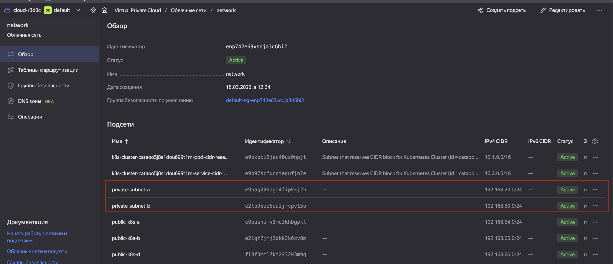
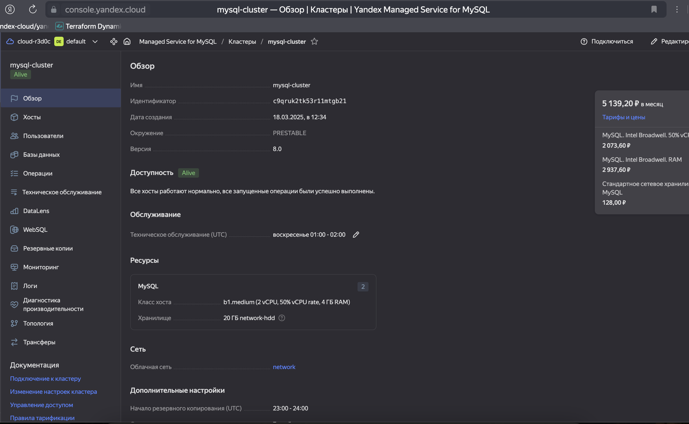
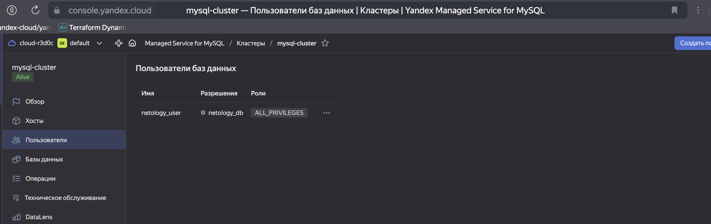
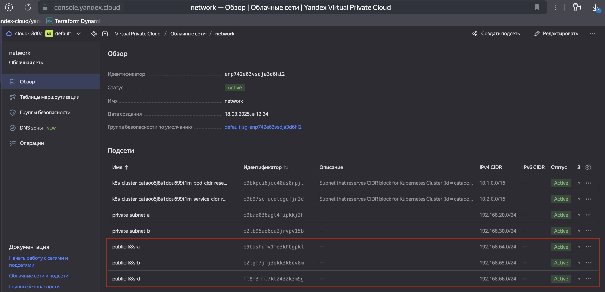
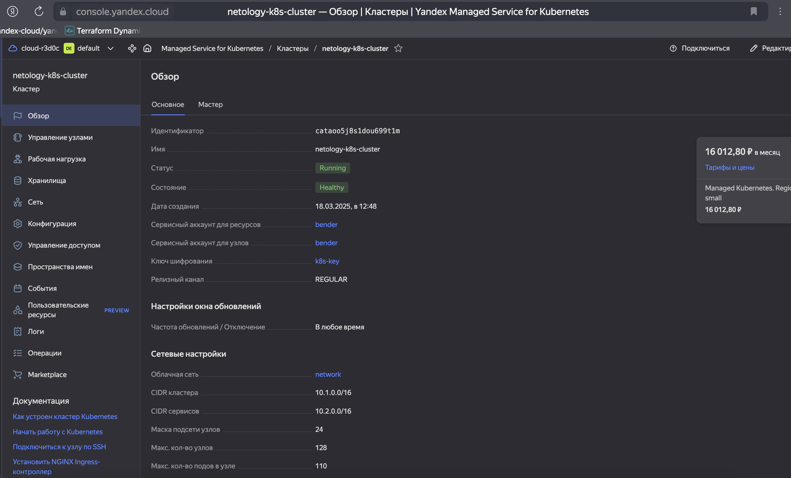
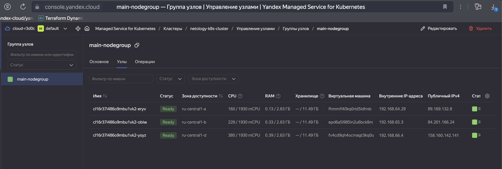
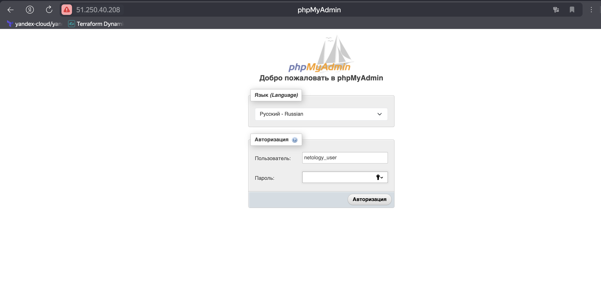
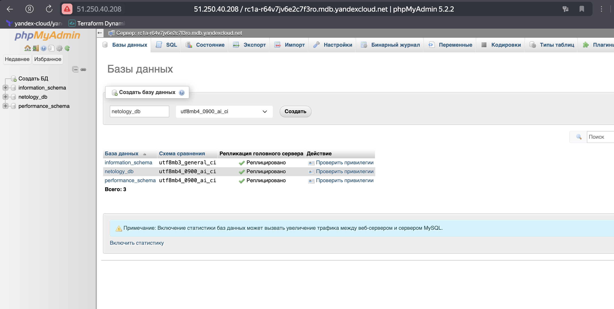

# Домашнее задание к занятию «Кластеры. Ресурсы под управлением облачных провайдеров»

### Цели задания 

1. Организация кластера Kubernetes и кластера баз данных MySQL в отказоустойчивой архитектуре.
2. Размещение в private подсетях кластера БД, а в public — кластера Kubernetes.

---
## Задание 1. Yandex Cloud

1. Настроить с помощью Terraform кластер баз данных MySQL.

 - Используя настройки VPC из предыдущих домашних заданий, добавить дополнительно подсеть private в разных зонах, чтобы обеспечить отказоустойчивость. 
 - Разместить ноды кластера MySQL в разных подсетях.
 - Необходимо предусмотреть репликацию с произвольным временем технического обслуживания.
 - Использовать окружение Prestable, платформу Intel Broadwell с производительностью 50% CPU и размером диска 20 Гб.
 - Задать время начала резервного копирования — 23:59.
 - Включить защиту кластера от непреднамеренного удаления.
 - Создать БД с именем `netology_db`, логином и паролем.

#### Решение

1. Создаем дополнительные подсети в разных зонах для обеспечения отказоустойчивости.



2. Создаем кластер MySQL с репликацией, резервным копированием и защитой от удаления, так же создаем базу данных `netology_db` с логином `netology_user` и паролем.

```bash
alekseykashin@Mac terraform % terraform apply   

Terraform used the selected providers to generate the following execution plan.
Resource actions are indicated with the following symbols:
  + create

Terraform will perform the following actions:

  # yandex_mdb_mysql_cluster.mysql_cluster will be created
  + resource "yandex_mdb_mysql_cluster" "mysql_cluster" {
      + allow_regeneration_host   = false
      + backup_retain_period_days = (known after apply)
      + created_at                = (known after apply)
      + deletion_protection       = true
      + environment               = "PRESTABLE"
      + folder_id                 = (known after apply)
      + health                    = (known after apply)
      + host_group_ids            = (known after apply)
      + id                        = (known after apply)
      + mysql_config              = (known after apply)
      + name                      = "mysql-cluster"
      + network_id                = (known after apply)
      + status                    = (known after apply)
      + version                   = "8.0"

      + access (known after apply)

      + backup_window_start {
          + hours   = 23
          + minutes = 59
        }

      + host {
          + assign_public_ip   = false
          + fqdn               = (known after apply)
          + replication_source = (known after apply)
          + subnet_id          = (known after apply)
          + zone               = (sensitive value)
        }
      + host {
          + assign_public_ip   = false
          + fqdn               = (known after apply)
          + replication_source = (known after apply)
          + subnet_id          = (known after apply)
          + zone               = (sensitive value)
        }

      + maintenance_window {
          + type = "ANYTIME"
        }

      + performance_diagnostics (known after apply)

      + resources {
          + disk_size          = 20
          + disk_type_id       = "network-ssd"
          + resource_preset_id = "b1.medium"
        }
    }

  # yandex_mdb_mysql_database.netology_db will be created
  + resource "yandex_mdb_mysql_database" "netology_db" {
      + cluster_id = (known after apply)
      + id         = (known after apply)
      + name       = "netology_db"
    }

  # yandex_mdb_mysql_user.netology_user will be created
  + resource "yandex_mdb_mysql_user" "netology_user" {
      + authentication_plugin = (known after apply)
      + cluster_id            = (known after apply)
      + global_permissions    = (known after apply)
      + id                    = (known after apply)
      + name                  = (sensitive value)
      + password              = (sensitive value)

      + connection_limits (known after apply)

      + permission {
          + database_name = "netology_db"
          + roles         = [
              + "ALL",
            ]
        }
    }

  # yandex_vpc_network.network will be created
  + resource "yandex_vpc_network" "network" {
      + created_at                = (known after apply)
      + default_security_group_id = (known after apply)
      + folder_id                 = (known after apply)
      + id                        = (known after apply)
      + labels                    = (known after apply)
      + name                      = "network"
      + subnet_ids                = (known after apply)
    }

  # yandex_vpc_subnet.private_subnet_a will be created
  + resource "yandex_vpc_subnet" "private_subnet_a" {
      + created_at     = (known after apply)
      + folder_id      = (known after apply)
      + id             = (known after apply)
      + labels         = (known after apply)
      + name           = "private-subnet-a"
      + network_id     = (known after apply)
      + v4_cidr_blocks = [
          + "192.168.20.0/24",
        ]
      + v6_cidr_blocks = (known after apply)
      + zone           = (sensitive value)
    }

  # yandex_vpc_subnet.private_subnet_b will be created
  + resource "yandex_vpc_subnet" "private_subnet_b" {
      + created_at     = (known after apply)
      + folder_id      = (known after apply)
      + id             = (known after apply)
      + labels         = (known after apply)
      + name           = "private-subnet-b"
      + network_id     = (known after apply)
      + v4_cidr_blocks = [
          + "192.168.30.0/24",
        ]
      + v6_cidr_blocks = (known after apply)
      + zone           = (sensitive value)
    }

Plan: 6 to add, 0 to change, 0 to destroy.

Do you want to perform these actions?
  Terraform will perform the actions described above.
  Only 'yes' will be accepted to approve.

  Enter a value: yes

yandex_vpc_network.network: Creating...
yandex_vpc_network.network: Creation complete after 1s [id=enpu0ahgh2j5s0mm8a24]
yandex_vpc_subnet.private_subnet_a: Creating...
yandex_vpc_subnet.private_subnet_b: Creating...
yandex_vpc_subnet.private_subnet_b: Creation complete after 1s [id=e2l3imj6efbn1s0m4kat]
yandex_vpc_subnet.private_subnet_a: Creation complete after 1s [id=e9bvuvf32fr7jb9ir83u]
yandex_mdb_mysql_cluster.mysql_cluster: Still creating... [10s elapsed]
yandex_mdb_mysql_cluster.mysql_cluster: Still creating... [20s elapsed]
yandex_mdb_mysql_cluster.mysql_cluster: Still creating... [30s elapsed]
yandex_mdb_mysql_cluster.mysql_cluster: Still creating... [40s elapsed]
yandex_mdb_mysql_cluster.mysql_cluster: Still creating... [50s elapsed]
yandex_mdb_mysql_cluster.mysql_cluster: Still creating... [1m0s elapsed]
yandex_mdb_mysql_cluster.mysql_cluster: Still creating... [1m10s elapsed]
yandex_mdb_mysql_cluster.mysql_cluster: Still creating... [1m20s elapsed]
yandex_mdb_mysql_cluster.mysql_cluster: Still creating... [1m30s elapsed]
yandex_mdb_mysql_cluster.mysql_cluster: Still creating... [1m40s elapsed]
yandex_mdb_mysql_cluster.mysql_cluster: Still creating... [1m50s elapsed]
yandex_mdb_mysql_cluster.mysql_cluster: Still creating... [2m0s elapsed]
yandex_mdb_mysql_cluster.mysql_cluster: Still creating... [2m10s elapsed]
yandex_mdb_mysql_cluster.mysql_cluster: Still creating... [2m20s elapsed]
yandex_mdb_mysql_cluster.mysql_cluster: Still creating... [2m30s elapsed]
yandex_mdb_mysql_cluster.mysql_cluster: Still creating... [2m40s elapsed]
yandex_mdb_mysql_cluster.mysql_cluster: Still creating... [2m50s elapsed]
yandex_mdb_mysql_cluster.mysql_cluster: Still creating... [3m0s elapsed]
yandex_mdb_mysql_cluster.mysql_cluster: Still creating... [3m10s elapsed]
yandex_mdb_mysql_cluster.mysql_cluster: Still creating... [3m20s elapsed]
yandex_mdb_mysql_cluster.mysql_cluster: Still creating... [3m30s elapsed]
yandex_mdb_mysql_cluster.mysql_cluster: Still creating... [3m40s elapsed]
yandex_mdb_mysql_cluster.mysql_cluster: Still creating... [3m50s elapsed]
yandex_mdb_mysql_cluster.mysql_cluster: Still creating... [4m0s elapsed]
yandex_mdb_mysql_cluster.mysql_cluster: Still creating... [4m10s elapsed]
yandex_mdb_mysql_cluster.mysql_cluster: Still creating... [4m20s elapsed]
yandex_mdb_mysql_cluster.mysql_cluster: Still creating... [4m30s elapsed]
yandex_mdb_mysql_cluster.mysql_cluster: Still creating... [4m40s elapsed]
yandex_mdb_mysql_cluster.mysql_cluster: Still creating... [4m50s elapsed]
yandex_mdb_mysql_cluster.mysql_cluster: Still creating... [5m0s elapsed]
yandex_mdb_mysql_cluster.mysql_cluster: Still creating... [5m10s elapsed]
yandex_mdb_mysql_cluster.mysql_cluster: Still creating... [5m20s elapsed]
yandex_mdb_mysql_cluster.mysql_cluster: Still creating... [5m30s elapsed]
yandex_mdb_mysql_cluster.mysql_cluster: Still creating... [5m40s elapsed]
yandex_mdb_mysql_cluster.mysql_cluster: Still creating... [5m50s elapsed]
yandex_mdb_mysql_cluster.mysql_cluster: Still creating... [6m0s elapsed]
yandex_mdb_mysql_cluster.mysql_cluster: Still creating... [6m10s elapsed]
yandex_mdb_mysql_cluster.mysql_cluster: Still creating... [6m20s elapsed]
yandex_mdb_mysql_cluster.mysql_cluster: Still creating... [6m30s elapsed]
yandex_mdb_mysql_cluster.mysql_cluster: Still creating... [6m40s elapsed]
yandex_mdb_mysql_cluster.mysql_cluster: Still creating... [6m50s elapsed]
yandex_mdb_mysql_cluster.mysql_cluster: Still creating... [7m0s elapsed]
yandex_mdb_mysql_cluster.mysql_cluster: Still creating... [7m10s elapsed]
yandex_mdb_mysql_cluster.mysql_cluster: Still creating... [7m20s elapsed]
yandex_mdb_mysql_cluster.mysql_cluster: Still creating... [7m30s elapsed]
yandex_mdb_mysql_cluster.mysql_cluster: Still creating... [7m40s elapsed]
yandex_mdb_mysql_cluster.mysql_cluster: Still creating... [7m50s elapsed]
yandex_mdb_mysql_cluster.mysql_cluster: Still creating... [8m0s elapsed]
yandex_mdb_mysql_cluster.mysql_cluster: Still creating... [8m10s elapsed]
yandex_mdb_mysql_cluster.mysql_cluster: Still creating... [8m20s elapsed]
yandex_mdb_mysql_cluster.mysql_cluster: Still creating... [8m30s elapsed]
yandex_mdb_mysql_cluster.mysql_cluster: Still creating... [8m40s elapsed]
yandex_mdb_mysql_cluster.mysql_cluster: Still creating... [8m50s elapsed]
yandex_mdb_mysql_cluster.mysql_cluster: Still creating... [9m0s elapsed]
yandex_mdb_mysql_cluster.mysql_cluster: Still creating... [9m10s elapsed]
yandex_mdb_mysql_cluster.mysql_cluster: Creation complete after 9m11s [id=c9q0v9522813vaoa1587]
yandex_mdb_mysql_database.netology_db: Creating...
yandex_mdb_mysql_database.netology_db: Still creating... [10s elapsed]
yandex_mdb_mysql_database.netology_db: Creation complete after 20s [id=c9q0v9522813vaoa1587:netology_db]
yandex_mdb_mysql_user.netology_user: Creating...
yandex_mdb_mysql_user.netology_user: Still creating... [10s elapsed]
yandex_mdb_mysql_user.netology_user: Still creating... [20s elapsed]
yandex_mdb_mysql_user.netology_user: Creation complete after 21s [id=c9q0v9522813vaoa1587:netology_user]

Apply complete! Resources: 3 added, 0 changed, 1 destroyed.
Outputs:

mysql_host = "rc1a-ibavkvhiljctq9cl.mdb.yandexcloud.net"
mysql_user = "netology_user"
...
```

- Созданный кластер


- Созданный пользователь `netology_user`



2. Настроить с помощью Terraform кластер Kubernetes.

 - Используя настройки VPC из предыдущих домашних заданий, добавить дополнительно две подсети public в разных зонах, чтобы обеспечить отказоустойчивость.
 - Создать отдельный сервис-аккаунт с необходимыми правами. 
 - Создать региональный мастер Kubernetes с размещением нод в трёх разных подсетях.
 - Добавить возможность шифрования ключом из KMS, созданным в предыдущем домашнем задании.
 - Создать группу узлов, состояющую из трёх машин с автомасштабированием до шести.
 - Подключиться к кластеру с помощью `kubectl`.
 - *Запустить микросервис phpmyadmin и подключиться к ранее созданной БД.
 - *Создать сервис-типы Load Balancer и подключиться к phpmyadmin. Предоставить скриншот с публичным адресом и подключением к БД.

#### Решение


1. Создаем дополнительные публичные подсети в разных зонах для обеспечения отказоустойчивости.




2. Создаем Kubernetes с размещением нод в трёх разных подсетях.





3. Подключаемся к кластеру с помощью kubectl.

```bash
alekseykashin@Mac terraform % yc managed-kubernetes cluster get-credentials --id cataoo5j8s1dou699t1m --external

Context 'yc-netology-k8s-cluster' was added as default to kubeconfig '/Users/alekseykashin/.kube/config'.
Check connection to cluster using 'kubectl cluster-info --kubeconfig /Users/alekseykashin/.kube/config'.

Note, that authentication depends on 'yc' and its config profile 'default'.
To access clusters using the Kubernetes API, please use Kubernetes Service Account.
There is a new yc version '0.144.0' available. Current version: '0.133.0'.
See release notes at https://yandex.cloud/ru/docs/cli/release-notes
You can install it by running the following command in your shell:
	$ yc components update
```

4. Создать серви микросервис phpmyadmin, подключаем к БД, создаем Load Balancer для доступа к phpmyadmin. [deployment.yaml](terraform/k8s_resources/deployment.yaml)

```bash
alekseykashin@Mac terraform % kubectl get nodes
NAME                        STATUS   ROLES    AGE   VERSION
cl16r37i486o9mbu1vk2-eryv   Ready    <none>   33m   v1.29.1
cl16r37i486o9mbu1vk2-obiw   Ready    <none>   34m   v1.29.1
cl16r37i486o9mbu1vk2-ysyz   Ready    <none>   34m   v1.29.1
alekseykashin@Mac terraform % 
```

```bash
alekseykashin@Mac k8s_resources % kubectl get svc  -o wide
NAME            TYPE           CLUSTER-IP     EXTERNAL-IP     PORT(S)        AGE     SELECTOR
kubernetes      ClusterIP      10.2.128.1     <none>          443/TCP        125m    <none>
phpmyadmin-lb   LoadBalancer   10.2.213.167   51.250.40.208   80:30681/TCP   4m39s   app=phpmyadmin
```

```bash
alekseykashin@Mac k8s_resources % kubectl apply -f deployment.yaml 
deployment.apps/phpmyadmin created
service/phpmyadmin-lb created
```

5. Подключаемся к БД через публичный адрес phpmyadmin.





Полезные документы:

- [MySQL cluster](https://registry.terraform.io/providers/yandex-cloud/yandex/latest/docs/resources/mdb_mysql_cluster).
- [Создание кластера Kubernetes](https://cloud.yandex.ru/docs/managed-kubernetes/operations/kubernetes-cluster/kubernetes-cluster-create)
- [K8S Cluster](https://registry.terraform.io/providers/yandex-cloud/yandex/latest/docs/resources/kubernetes_cluster).
- [K8S node group](https://registry.terraform.io/providers/yandex-cloud/yandex/latest/docs/resources/kubernetes_node_group).

--- 
## Задание 2*. Вариант с AWS (задание со звёздочкой)

Это необязательное задание. Его выполнение не влияет на получение зачёта по домашней работе.

**Что нужно сделать**

1. Настроить с помощью Terraform кластер EKS в три AZ региона, а также RDS на базе MySQL с поддержкой MultiAZ для репликации и создать два readreplica для работы.
 
 - Создать кластер RDS на базе MySQL.
 - Разместить в Private subnet и обеспечить доступ из public сети c помощью security group.
 - Настроить backup в семь дней и MultiAZ для обеспечения отказоустойчивости.
 - Настроить Read prelica в количестве двух штук на два AZ.

2. Создать кластер EKS на базе EC2.

 - С помощью Terraform установить кластер EKS на трёх EC2-инстансах в VPC в public сети.
 - Обеспечить доступ до БД RDS в private сети.
 - С помощью kubectl установить и запустить контейнер с phpmyadmin (образ взять из docker hub) и проверить подключение к БД RDS.
 - Подключить ELB (на выбор) к приложению, предоставить скрин.

Полезные документы:

- [Модуль EKS](https://learn.hashicorp.com/tutorials/terraform/eks).

### Правила приёма работы

Домашняя работа оформляется в своём Git репозитории в файле README.md. Выполненное домашнее задание пришлите ссылкой на .md-файл в вашем репозитории.
Файл README.md должен содержать скриншоты вывода необходимых команд, а также скриншоты результатов.
Репозиторий должен содержать тексты манифестов или ссылки на них в файле README.md.
